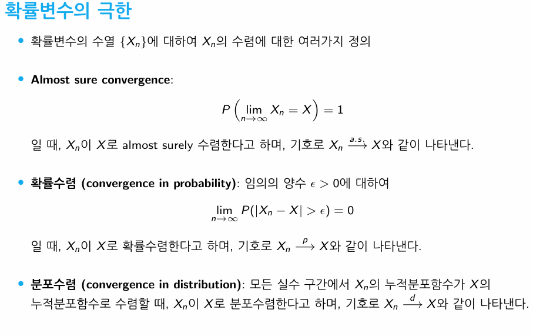
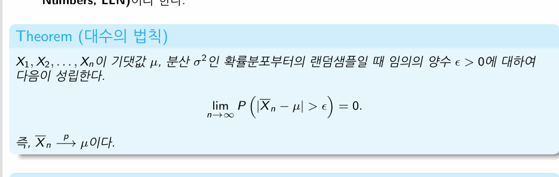

```{r setup, include=FALSE}
knitr::opts_chunk$set(echo = TRUE)
```

## 수리통계학 2 OT

10,7 10.9 온라인 강의(그 주 내 에 듣기)

시험 전 문제 리스트 줄 것임

중간 35, 기말 45, 출석10, 과제 20

과제 -\> 과정을 중요시하기

강의 방식 : 판서식

받아적으려고 말을 잘 못듣는데, 필기한걸 매주 올릴테니까 적는거에 집중하ㅣ마라

말하는 것을 오히려 받아적어라(안적혀있는거)

즉 노트북으로 적자 나

------------------------------------------------------------------------

## 1-1 시작

Outline 1 확률변수의극한 2 대수의법칙 3 분포수렴 4 중심극한정리

### 1

확률변수란? : 함수이다. 오메가에서 실수공간으로 가는 함수임.

(수열의)극한은? 수열 AN이 있다. 수열의 극한이 A다를 표현-\> 수학적 정의는 주어진 양수 입실론에 대해서,

입신론은 A의 근처를 설정한 것. 가까이 가는 지점이 존재한다는 말임 즉 자연수N이 존재해서, n\>-N, 엔 이후의 모든 수열은 절댓값 AN-A절댓값이 입실론보다 작다?

확률변수의 극한은 더 어려움

확률변수는 함수인데, 함수가 어디론가 가까이간다 라는 의미는 종류가 주로 통계학에선 3가지임

확률변수의수열{Xn}에대하여Xn의수렴에대한여러가지정의 

이 중 분포수렴이 많을 것. 첫번잰 껏 잘 만나지 못할 것

XN이X로 수렴하는 것이 확실히 일어남(1번)

그 수렴하는 사건의 확률이 1이되는 것이 ALMOST SURE CONVERGENCE

오메가는표본공간, (강노참조)

다 갖고왔을 떄 하나의 사건이된다. 사건은 표본의 부분집합이다. 이것이 어쩌고 될때 얼모스트 슈어하다

오메가만 다 모으면 이 집합은 1/2뺴곤 두 개가 같으니, [0,1/2)U(1/2,1]

P 확률은 1이된다. 그럼 ALMOST SURE한다고 하는 것

2.  확률수렴

    확률의 극한값이 0이면 확률수렴한다. 아까는 P안에 리밋엔이 있엇지만, 지금은 P바깥에 리밋이있음

    함수의 차이가 입십론보다 큰..

    그래서 XN이X로 확률수렴한다.

3.  분포수렴 Xn converges to X in distribution

앞에 2개와 다른 건 동일한 확률공간에서 정의 안되어도 됌

여긴 x와 xn다르게 확률 계산하고있음 따라서 저렇게 바꿔도됌?(다른 확률변수로 해도 y등 , 즉 확률분포수렴이라 ㅇㅇ

3번에서 모든실수구간까지 필요없음, 모든 CDF임

1-\>3 맞으나, 역은 성립치 않는다.(증명하심 강노에)

XN이 상수로 분포수렴하면은,

상수도 어찌보면 확률변수라고 생각할수있음 항상 그 확률 값을 가짐 그 분포수렴하는 경우는 역도 수렴한다.\\기호는 빼는 것

## 대수의 법칙

랜덤샘플 = iid, 서로 독립이고 같은 분포를 가진다.

표본평군이 기댓값 뮤로 확률수렴한다.(추가조건은 분산이 존재임. 원래는 필요없다?

기댓값이 존재하지 않는건 x의기댓값의 절댓값이 발산하면 ㅇㅇㅇ



이걸 반대로 이야기하면 뮤 근처에 있는 확률이 1이다

웬만하면 표본평균이 뮤 근처에 있다. 근데 이건 극한의 개념이다. 근데 실제로 n이 올라가는 거봤음? 잘 안그럼 근데 극한의 개념을 왜쓸까?

이제 다시 수열의 극한개념으로 가보자.

수열의 극한은 어떤 입실론이든\~ 샘플 사이즈가 커지면 점점차이가작아진다. 충분히 큰 샘플사이즈 확보만 가능하다면 \~ 어쩌고 되기때문이다

증명은 체비세프 (강노 확인)

확률변수는 지시변수의 indicator로 계산할수있다

P(A)=E Ia

표폰병균의 기댓값은 얼마냐 이것도 뮤이다

XI들의 기댓값은 뮤이다.

저 식을 우리는 분산이라고함 뺀거 어쩌고

표본평균의 분산은 시그마제곱/N

근데 우리가 최종적으로 보이는 건 극한이다.

이 극한은 0이다.

## 분포수렴

간단히 비유하자면, 과녁에 화살을 쏠 때 n이 커질수록 화살이 과녁의 중앙(μ)에 점점 모이는 현상이 '대수의 법칙'이고, 그 중앙 주변에 박힌 화살들의 흩어진 모양이 '정규분포'를 따르는 현상이 '중심극한정리'입니다.

p6 분포수렴 예제
xn을 z_bar로 표현
cdf of xn 은 xn이 x보다 작을 확률임(식 참조)
sqrt(n) 곱함

0의 cdf는 뭘까

p7 
순서통계량.
두 사건이 같다(?) ind조거하에
