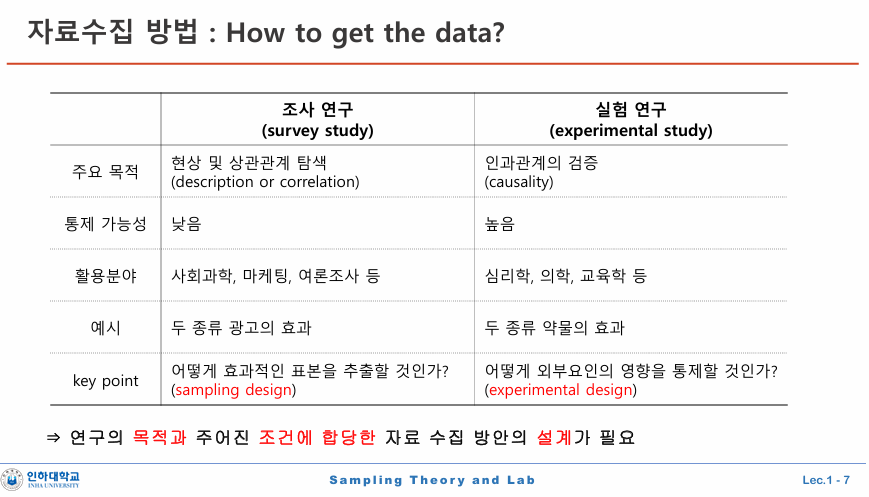

------------------------------------------------------------------------

title: "1주차 강의록" output: html_document date: "2025-09-01"

# 1주차 개요

◆ 교 재: SAS와R을활용한표본설계와통계적추론제2판(박민규∙강현철공저, 자유아카데미, 2023년)

-\>시험기간 때 보는 게 좋음

• 출석(5%), 과제(20%), 중간고사(30%), 기말고사(40%), 기타(5%) • ‘기타평가’ 내용 : 문/답및토론시능동적이고적극적인참여등에가점

◆ Lec.1 \~ Lec.3 \* 서베이통계학의 특징과 몇가지배경지식 \* 확률표본설계와 비편향 추정량 ◆ Lec.4 \~ Lec.7 \* 단순임의추출법, 계통추출법 \* 층화추출법 ◆ Lec.9 \~ Lec.13 \* 보조정보를 이용한 추정 \* 집락추출법, 복합표본설계 ◆ Lec.14 \* 팀 프로젝트 발표

◆ 강의개요 • 사회통계및경제통계분야에서널리활용되고있는서베이(survey)의기본요소들을이해하는데 필요한통계적 지식과기법, 사례연구로구성 • 먼저단순임의추출법, 층화추출법, 계통추출법, 집락추출법등여러가지표본추출방법과각추출방법에서모수 추정등통계적추론방법을익히고, 주요통계작성기관에서수행하고있는표본설계사례를통해표본조사의 절차및활용방법을이해하는데중점을두고강의

표본론 이론 뿐 아니라 수통, 회귀 등에서 배웠던 내용과도 어떻게 연결되는지 이야기할 것

실습.

사내 조사 등을 할수도 있다. ◆ 강의목표 • 다양한표본추출방법에대해이해하고, 각추출방법에서통계적추론을적용할수있다. • 사례연구및실습을통해주어진자료와상황에적합한표본설계를수행하고분석결과를해석및설명할수있다

## 시작

◆ 신뢰할수있는자료란... \* (목적에 부합) 분석하고자 하는 목적에 합당해야 하고 \* (객관성) 자료수집 과정에 주관적 편견이 배제되어야하며 \* (대표성) 연구 대상집단을잘 대표해야한다.

◆ 선택편향(selection bias) \* 목표집단(target)과 조사집단(sample)의 불일치(확인하기) \* 행정자료와 같은 보고자료(recording data) 역시 선택편향또는대표성(representativeness)에 한계가 있음

## 자료수집방법: 조사vs실험

◆ 조사(survey) \* 주어진 현상에 대한 관찰(observation) \* 현상이나사건사이의상관관계탐색 \* 조사 대상에 대한인위적조절이불가능하며통상대상집단의총 개체가유한(finite)함

◆ 실험(experiment)(요인과 반응, 약의 효과 10미리 투여 12미리 투여 등) \* 실험의 대상, 즉 처리 결과의 측정(measurement) \* 요인과반응사이의인과관계규명 \* 실험 대상에 대한인위적조절이가능하며대체로조절가능한수준의수가무한(infinite)함 ⇒ 조사와 실험의차이: 인과성 여부 “흡연자 9명당1명꼴로 폐암이관측되었다” 흡연과 폐암의인과성을 단정할 수 있을까

오차의 주요 원인

1 포함오차 : 조사응답자 != 투표참여자

2 무응답오차 : 응답자 !=무응답자

3 측정오차 : 응답!=실제

4 그외

대선 4개 연속 출구조사와 실제 득표율에서 국힘이 후자에서 높아지고, 민주는 높아지는 경향이 있네

shy 국힘이 많다는 뜻 등으로 요인이 더 있을듯

출구조사맹점은 선거 당일날 나온 사람으로 함

사전투표가 빠짐(단 사전투표는 전화조사로 반영)

하나는 8만(당일) 사전은 1만

어떻게하면 적은 숟가락으로 잘 마줄것인가?

잘섞음

표본오차는 표본크기로 조정 가능
