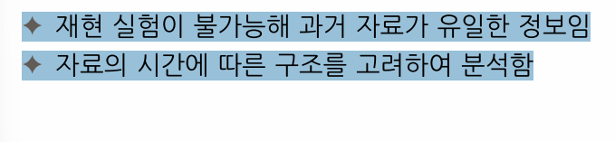

```{r setup, include=FALSE}
knitr::opts_chunk$set(echo = TRUE)
```

## 교재

시계열 분석: 이론 및 R 실습

:SAS/ETS를 이용한 시계열분석 (제5판) 저자: 조신섭

프로젝트 형식으로 팀 보고서 있음

Y라는 확률변수가 T시점에서

시계열 분석은 각 시점 하나밖에없어서 이걸 살려서 분석해야함

과거자료와 같은 분포를 가정하고 하는 것

주로 수업에서 다룬 건, undefined


연속 시계열 : ex 주식(다루기 힘들어서)
이산 시계열 ex 종가(주식)[수업에선 이걸로 다룰거ㅇ임]


